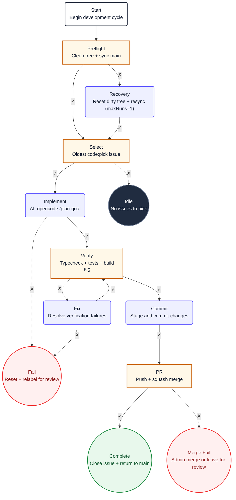

# Loop Task Diagram

A recipe's task graph is its **chain**. Each task in `tasks[]` is a node; each `onSuccessTaskId` and `onFailureTaskId` is an edge. The `loops[].taskId` points at the **entry** node. A task with both edges null is a **terminator**. This skill reads a `.loops/recipes/*.yaml` file, maps its chain to a Mermaid flowchart, and writes it back into the `diagram:` field of the same YAML file using AST-preserving round-trips so the rest of the file stays untouched.

## Your task

1. **Read the recipe.** Parse the `.yaml` file. Extract `loops[]`, `tasks[]`. Completion criterion: every task id accounted for, the entry `taskId` identified, every `onSuccessTaskId` and `onFailureTaskId` resolved to a target task or null.

2. **Map the chain to Mermaid.** Translate each schema field to its Mermaid representation using the glyph map below. Completion criterion: every task, edge, loop entry, and special flag (`silentChain`, non-default `maxRuns`) has a Mermaid decision.

3. **Render and write.** Generate the Mermaid flowchart. Write it into the `diagram:` field of the `.yaml` file as a YAML block scalar. The `yaml` package's Document API preserves the rest of the file byte-for-byte. Completion criterion: the diagram survives a read-write round-trip, passes every quality gate, and the file still loads in the daemon.

## Leading word: chain

A recipe's task graph is its **chain**. The word `chain` already lives in the loop-task codebase: `chain-executor.ts`, `silentChain`, `chainGroupId`. Reuse it. When you see `onSuccessTaskId`, think "the next link in the chain on success." When you see `silentChain: true`, think "a muted link." The chain has an **entry** (the `loops[].taskId`), **edges** (success and failure links), and **terminators** (links that lead nowhere).

## Node shapes and classes

Tasks are classified by their **role**, not their name. Each role gets a distinct Mermaid shape and color class.

```
ROLE          SHAPE            CLASS      FILL       WHEN
─────────     ──────           ─────      ────       ────
Start         ("label")        start      white      Exactly one per diagram.
                                                      Id = <prefix>Start (camelCase).
                                                      No edges in. Single edge out
                                                      to the entry task.

Decision      ["label"]        decision   orange      Task with BOTH success and
                                                      failure edges (branching).

Action        ("label")        action     purple      Task with only ONE outgoing
                                                      edge (linear), except
                                                      terminals.

Success end   (("label"))      success    green       Terminal task (both edges
                                                      null), not a failure.

Failure end   (("label"))      failure    red         Terminal task whose name
                                                      contains "fail", "recovery",
                                                      or "reset".

Idle end      (("label"))      idle       dark grey   Terminal task with
                                                      silentChain: true, or named
                                                      "Idle" / "Nothing".
```

### Class definitions (copy verbatim)

```
classDef start fill:#ffffff,stroke:#172033,stroke-width:2px,color:#172033
classDef action fill:#eef0ff,stroke:#554cff,stroke-width:2px,color:#172033
classDef decision fill:#fff8e8,stroke:#c75b00,stroke-width:2px,color:#172033
classDef idle fill:#202c40,stroke:#738198,stroke-width:2px,color:#ffffff
classDef failure fill:#fff0f0,stroke:#ef2929,stroke-width:2px,color:#8b1a1a
classDef success fill:#e8f8ec,stroke:#18883c,stroke-width:2px,color:#145a32
```

## Mermaid glyph map

Single source of truth for every schema field's Mermaid representation.

```
SCHEMA FIELD              MERMAID                                  NOTES
────────────              ───────                                  ─────
Direction                 flowchart TD                             always top-down

Start node                prefixStart("Start<br/>Purpose")        one per diagram
                                                                   id = prefix + Start
                                                                   class: start

onSuccessTaskId           -->|✓| target                            solid arrow with ✓ label

onFailureTaskId           -.->|✗| target                          dashed arrow with ✗ label

Decision task             taskId["Name<br/>Purpose"]              square brackets
                          class: decision                         (has both ✓ and ✗ edges)

Action task               taskId("Name<br/>Purpose")              round brackets
                          class: action                           (single outgoing edge)

Success terminal          taskId(("Name<br/>Purpose"))            double-round brackets
                          class: success                          (both edges null, not fail)

Failure terminal          taskId(("Name<br/>Purpose"))            double-round brackets
                          class: failure                          (both edges null, fail-like name)

Idle terminal             taskId(("Name<br/>Purpose"))            double-round brackets
                          class: idle                             (silentChain or "Idle"/"Nothing")

maxRuns on back-edge      ↻N appended to node label               ONLY on tasks that are
targets                   (e.g. "Verify<br/>Typecheck<br/>↻5")    back-edge targets (a task
                                                                  whose node you can revisit
                                                                  via a cycle). maxRuns is a
                                                                  safety limit for cycles.
                                                                  Remove maxRuns from all
                                                                  other tasks (terminals,
                                                                  linear steps don't need it).

maxRuns: 1 (recovery)     (maxRuns=1) in parentheses              Recovery tasks that must run
                                                                  exactly once, not a cycle
                                                                  limit.

maxRuns on loop-level     Not shown in diagram                    Loop-level maxRuns (in loops[])
                                                                  controls iteration count,
                                                                  not task retry. Don't show it
                                                                  in node labels.

Back-edge / cycle         Mermaid handles natively                just another edge,
                                                                   no special routing needed
```

## Node IDs

Node IDs use camelCase (no hyphens — Mermaid does not allow them). Map the task ID:

- `dev-preflight` → `devPreflight`
- `dev-clean-dirty` → `devCleanDirty`
- `dev-fail-merge` → `devFailMerge`

## Node labels

Every node shows a short name and a purpose. The name comes from the task's `name` field (shortened to ~15 chars). The purpose is a brief description of what the task does.

### Label format

```
taskId["Short name<br/>Purpose description"]
```

- **First line**: short task name
- **Second line**: purpose description, maxRuns badge if non-default
- Keep each line under 40 characters for readability
- Use `<br/>` for line breaks (never `\n`)

## Quality gates

Check every gate before writing the `diagram:` field. All must pass.

- [ ] Diagram has exactly one Start node with class `start`
- [ ] Every task in `tasks[]` has a node in the diagram
- [ ] Every non-null `onSuccessTaskId` has a solid `-->|✓|` edge
- [ ] Every non-null `onFailureTaskId` has a dashed `-.->|✗|` edge
- [ ] Decision tasks (both edges present) use `["..."]` shape with class `decision`
- [ ] Action tasks (single edge) use `("...")` shape with class `action`
- [ ] Terminal success tasks use `(("..."))` shape with class `success`
- [ ] Terminal failure tasks use `(("..."))` shape with class `failure`
- [ ] Terminal idle/silent tasks use `(("..."))` shape with class `idle`
- [ ] All six classDef lines are present verbatim
- [ ] Only back-edge target nodes show `↻N` in their label; no other maxRuns annotations
- [ ] `maxRuns` is removed from all tasks in the YAML that are not back-edge targets or recovery (maxRuns: 1)
- [ ] Recovery tasks with maxRuns: 1 show `(maxRuns=1)` in parentheses in their label
- [ ] Node IDs are camelCase (no hyphens, no reserved words like `end`)
- [ ] The diagram uses `flowchart TD` direction
- [ ] The Mermaid syntax is valid

## Worked example: dev loop

```yaml
loops:
  - taskId: dev-preflight
    intervalHuman: 20m
tasks:
  - id: dev-preflight
    name: Preflight
    onSuccessTaskId: dev-pick
    onFailureTaskId: dev-clean-dirty
  - id: dev-clean-dirty
    name: Recovery
    onSuccessTaskId: dev-pick
    onFailureTaskId: null
    maxRuns: 1
  - id: dev-pick
    name: Pick issue
    onSuccessTaskId: dev-implement
    onFailureTaskId: dev-nothing
  - id: dev-implement
    name: Implement
    onSuccessTaskId: dev-verify
    onFailureTaskId: dev-fail
  - id: dev-verify
    name: Verify
    onSuccessTaskId: dev-commit
    onFailureTaskId: dev-fix
    maxRuns: 5
  - id: dev-fix
    name: Fix
    onSuccessTaskId: dev-verify
    onFailureTaskId: dev-fail
  - id: dev-commit
    name: Commit
    onSuccessTaskId: dev-pr
    onFailureTaskId: null
  - id: dev-pr
    name: Create PR
    onSuccessTaskId: dev-complete
    onFailureTaskId: dev-fail-merge
  - id: dev-complete
    name: Complete
    onSuccessTaskId: null
    onFailureTaskId: null
  - id: dev-fail-merge
    name: Retry merge
    onSuccessTaskId: null
    onFailureTaskId: null
  - id: dev-fail
    name: Fail recovery
    onSuccessTaskId: null
    onFailureTaskId: null
  - id: dev-nothing
    name: Idle
    silentChain: true
    onSuccessTaskId: null
    onFailureTaskId: null
```

Expected `diagram:` output:



## Output contract

The skill writes the `diagram:` field inside the `.yaml` recipe file itself. The diagram is not a separate file; it is a real property of the recipe document, stored as a YAML block scalar (`|`).

```
LOOPS/RECIPES/DEV-LOOP.YAML
┌──────────────────────────────────────────┐
│ version: 2                               │
│                                          │
│ loops:                                   │ ← daemon reads
│   - taskId: dev-preflight                │
│     intervalHuman: 20m                   │
│                                          │
│ tasks:                                   │ ← daemon reads
│   - id: dev-preflight                    │
│     onSuccessTaskId: dev-pick            │
│   ...                                    │
│                                          │
│ diagram: |                               │ ← skill writes
│   flowchart TD                           │
│     devStart("Start<br/>...")            │
│       --> devPreflight                   │
│     ...                                  │
└──────────────────────────────────────────┘
```

**How to write:** Use the `yaml` package's `parseDocument()` to load the file as an AST. Set the `diagram` key to a block scalar containing the Mermaid flowchart. Call `String(doc)` to write back. The AST-preserving round-trip keeps every other field, comment, and formatting choice byte-for-byte.

**When to regenerate:** After creating a new recipe, after editing any task's `onSuccessTaskId`, `onFailureTaskId`, `silentChain`, `maxRuns`, `name`, or `steps[]`, or when the `diagram:` field is missing or stale. The daemon's `file-writer.ts` uses the same AST-preserving approach for override writes, so a runtime override to `intervalHuman` or `maxRuns` will not destroy the `diagram:` field.

## Not-for boundaries

Do not use this skill for:

- ASCII art diagrams. This skill produces Mermaid flowcharts that render in GitHub, VS Code, and Mermaid Live.
- Live loop state. The TUI board shows runtime status; this skill shows static recipe structure.
- Editing recipes. This skill is read-only for every field except `diagram:`. It never touches `loops[]`, `tasks[]`, or any data field.
- Tasks outside `.loops/recipes/`. Normal loops (created via `loop-task new`) do not have recipe files and are not diagrammed here.
- Photo editing, UI mockups, or interactive diagrams.

## Cross-Skill References

- For Loop cadence, iteration scheduling, and recipe file schema, load **`loop-task-loops`**. It tells you how to compose a Loop and write it as a `.loops/recipes/*.yaml` file.
- For Task execution, chaining, context, and success/failure edges, load **`loop-task-tasks`**. It defines the `onSuccessTaskId` and `onFailureTaskId` fields this skill diagrams.
- For Project organisation, load **`loop-task-projects`**.
