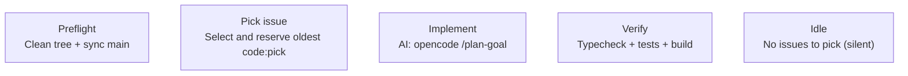
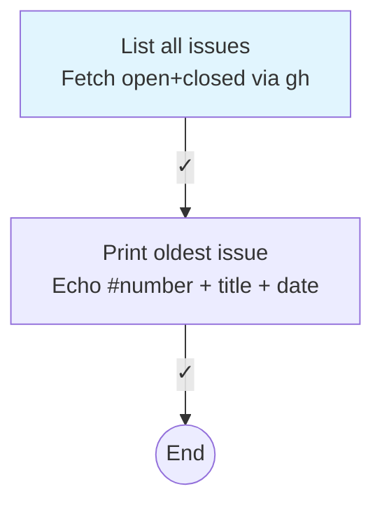
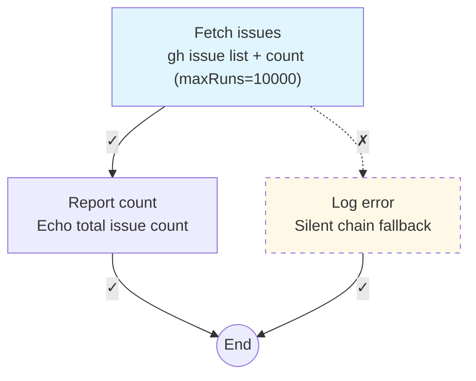
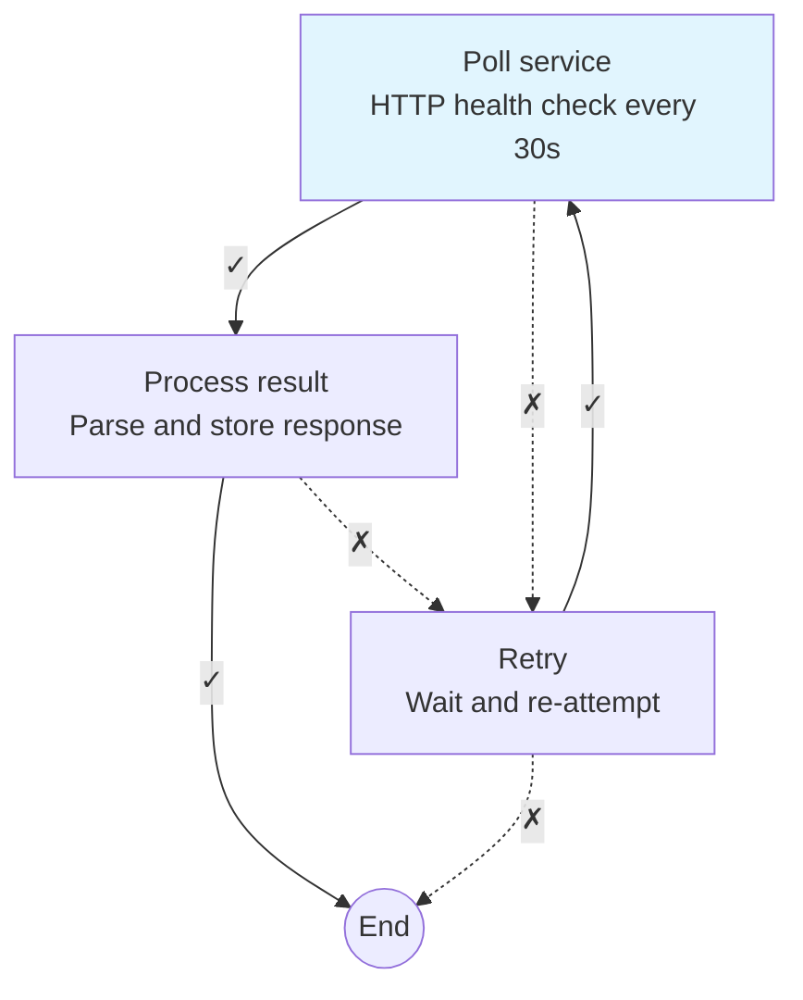
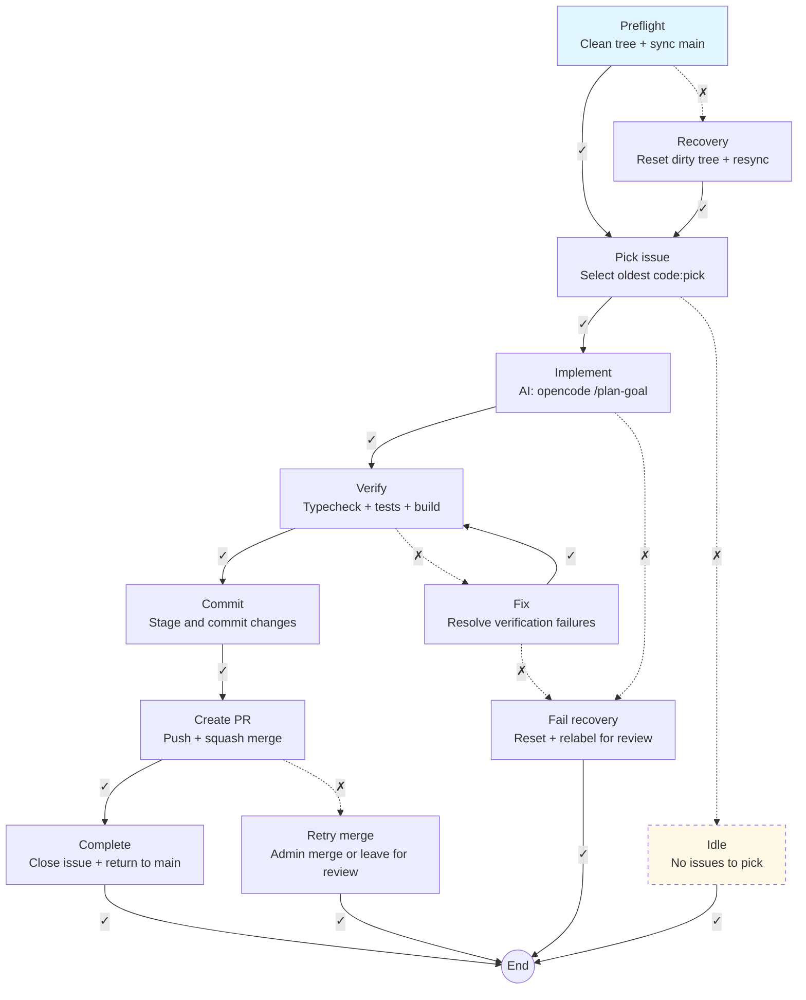

# Loop Task Diagram

A recipe's task graph is its **chain**. Each task in `tasks[]` is a node; each `onSuccessTaskId` and `onFailureTaskId` is an edge. The `loops[].taskId` points at the **entry** node. A task with both edges null is a **terminator**. This skill reads a `.loops/recipes/*.yaml` file, maps its chain to a Mermaid flowchart, and writes it back into the `diagram:` field of the same YAML file using AST-preserving round-trips so the rest of the file stays untouched.

## Your task

1. **Read the recipe.** Parse the `.yaml` file. Extract `loops[]`, `tasks[]`. Completion criterion: every task id accounted for, the entry `taskId` identified, every `onSuccessTaskId` and `onFailureTaskId` resolved to a target task or null.

2. **Map the chain to Mermaid.** Translate each schema field to its Mermaid representation using the glyph map below. Completion criterion: every task, edge, loop entry, and special flag (`silentChain`, non-default `maxRuns`) has a Mermaid decision.

3. **Render and write.** Generate the Mermaid flowchart. Write it into the `diagram:` field of the `.yaml` file as a YAML block scalar. The `yaml` package's Document API preserves the rest of the file byte-for-byte. Completion criterion: the diagram survives a read-write round-trip, passes every quality gate, and the file still loads in the daemon.

## Leading word: chain

A recipe's task graph is its **chain**. The word `chain` already lives in the loop-task codebase: `chain-executor.ts`, `silentChain`, `chainGroupId`. Reuse it. When you see `onSuccessTaskId`, think "the next link in the chain on success." When you see `silentChain: true`, think "a muted link." The chain has an **entry** (the `loops[].taskId`), **edges** (success and failure links), and **terminators** (links that lead nowhere).

## Mermaid glyph map

Single source of truth for every schema field's Mermaid representation.

```
SCHEMA FIELD              MERMAID                                  NOTES
────────────              ───────                                  ─────
Direction                 flowchart TD                             always top-down

Entry indicator           style <taskId> fill:#e1f5fe             light blue highlight
                          (only on the entry task)

onSuccessTaskId           -->|✓| target                            solid arrow with ✓ label

onFailureTaskId           -.->|✗| target                          dashed arrow with ✗ label

Task node                 taskId["name<br/>purpose"]              node ID = task ID with
                                                                    hyphens removed and
                                                                    next word capitalized
                                                                    (camelCase), e.g.
                                                                    dev-preflight → devPrefflight
                                                                    dev-clean-dirty → devCleanDirty
                                                                    use <br/> for line breaks

silentChain: true         class <taskId> silent                   applies CSS class
                          classDef silent                         stroke-dasharray: 5 5
                          stroke-dasharray:5 5,fill:#fef9e7       pale yellow fill

maxRuns (≠ 5)             appended to purpose line                e.g. "Preflight<br/>(maxRuns=3)"
                          DEFAULT_TASK_MAX_RUNS = 5, so only
                          show when the value differs

steps[]                   subgraph "steps"                        wraps the multi-step
                          within the node label, list              commands inside the
                          each step on a new line                 node label

Terminal (both edges      finalNode(("End"))                       double-circle terminal
onSuccess+onFailure                                                node ID in camelCase,
are null)                                                          "end" is reserved in
                                                                   Mermaid, use finalNode
                                                                   or similar

Back-edge / cycle         Mermaid handles natively                just another edge,
                                                                  no special routing needed
```

## Node labels: ID + purpose

Every node must show both the task ID (as the Mermaid node reference) and a human-readable description. The description comes from the task's `name` field — this is the **purpose** of the task.

### Label format

```
taskId["Short name<br/>Purpose description"]
```

- **First line**: the task's `name` field (bold by default in Mermaid)
- **Second line** (optional): additional context if the `name` alone is unclear — append `maxRuns` badge if non-default, append `(silent)` if `silentChain: true`

### Examples



### Shortening rules

- If the `name` field is already descriptive, use it as-is on one line
- If the `name` is terse (e.g. "Fix"), add a second line with more context from the recipe
- Keep each line under 40 characters for readability
- The task ID is the Mermaid node identifier, not shown in the rendered label unless it adds clarity

## Quality gates

Check every gate before writing the `diagram:` field. All must pass.

- [ ] Every task in `tasks[]` has a node in the diagram
- [ ] Every non-null `onSuccessTaskId` has a solid `-->|✓|` edge
- [ ] Every non-null `onFailureTaskId` has a dashed `-.->|✗|` edge
- [ ] The entry task (from `loops[].taskId`) has the `fill:#e1f5fe` style
- [ ] If there are loop-level properties (`intervalHuman`, `maxRuns`), they appear as a note on the entry edge or in a comment above the flowchart
- [ ] Tasks with `silentChain: true` have the `silent` CSS class applied
- [ ] Tasks with non-default `maxRuns` (≠ 5) have `[maxRuns=N]` in their label
- [ ] Terminal tasks (both edges null) end at an `finalNode(("End"))` node
- [ ] The diagram uses `flowchart TD` direction
- [ ] The Mermaid syntax is valid (no unescaped special characters in labels)
- [ ] Multiple tasks that terminate can share one `finalNode(("End"))` node

## Worked examples

### Example 1: linear chain (issue-oldest.yaml)

```yaml
loops:
  - taskId: list-issues
    intervalHuman: "0"
tasks:
  - id: list-issues
    name: List all issues
    onSuccessTaskId: print-oldest
    onFailureTaskId: null
  - id: print-oldest
    name: Print oldest issue
    onSuccessTaskId: null
    onFailureTaskId: null
```

Expected `diagram:` output:



### Example 2: branching with silent chain (issue-count-silent-check.yaml)

```yaml
loops:
  - taskId: fetch-issues
    intervalHuman: 10s
    maxRuns: 10000
tasks:
  - id: fetch-issues
    name: Fetch issues
    onSuccessTaskId: report
    onFailureTaskId: log-silent-error
  - id: report
    name: Report count
    onSuccessTaskId: null
    onFailureTaskId: null
  - id: log-silent-error
    name: Log error
    silentChain: true
    onSuccessTaskId: null
    onFailureTaskId: null
```

Expected `diagram:` output:



### Example 3: cyclic chain (synthetic)

```yaml
loops:
  - taskId: poll
    intervalHuman: 30s
tasks:
  - id: poll
    name: Poll service
    onSuccessTaskId: process
    onFailureTaskId: retry
  - id: process
    name: Process result
    onSuccessTaskId: null
    onFailureTaskId: retry
  - id: retry
    name: Retry
    onSuccessTaskId: poll
    onFailureTaskId: null
```

Expected `diagram:` output:



### Example 4: dev loop with recovery (dev-loop.yaml)

```yaml
loops:
  - taskId: dev-preflight
    intervalHuman: 20m
tasks:
  - id: dev-preflight
    name: Preflight
    onSuccessTaskId: dev-pick
    onFailureTaskId: dev-clean-dirty
  - id: dev-clean-dirty
    name: Recovery
    onSuccessTaskId: dev-pick
    onFailureTaskId: null
  - id: dev-pick
    name: Pick issue
    onSuccessTaskId: dev-implement
    onFailureTaskId: dev-nothing
  - id: dev-implement
    name: Implement
    onSuccessTaskId: dev-verify
    onFailureTaskId: dev-fail
  - id: dev-verify
    name: Verify
    onSuccessTaskId: dev-commit
    onFailureTaskId: dev-fix
  - id: dev-fix
    name: Fix
    onSuccessTaskId: dev-verify
    onFailureTaskId: dev-fail
  - id: dev-commit
    name: Commit
    onSuccessTaskId: dev-pr
    onFailureTaskId: null
  - id: dev-pr
    name: Create PR
    onSuccessTaskId: dev-complete
    onFailureTaskId: dev-fail-merge
  - id: dev-complete
    name: Complete
    onSuccessTaskId: null
    onFailureTaskId: null
  - id: dev-fail-merge
    name: Retry merge
    onSuccessTaskId: null
    onFailureTaskId: null
  - id: dev-fail
    name: Fail recovery
    onSuccessTaskId: null
    onFailureTaskId: null
  - id: dev-nothing
    name: Idle
    silentChain: true
    onSuccessTaskId: null
    onFailureTaskId: null
```

Expected `diagram:` output:



## Output contract

The skill writes the `diagram:` field inside the `.yaml` recipe file itself. The diagram is not a separate file; it is a real property of the recipe document, stored as a YAML block scalar (`|`).

```
LOOPS/RECIPES/ISSUE-OLDEST.YAML
┌──────────────────────────────────────────┐
│ version: 2                               │
│                                          │
│ loops:                                   │ ← daemon reads
│   - taskId: list-issues                  │
│     intervalHuman: "0"                   │
│                                          │
│ tasks:                                   │ ← daemon reads
│   - id: list-issues                      │
│     onSuccessTaskId: print-oldest       │
│   - id: print-oldest                     │
│     ...                                  │
│                                          │
│ diagram: |                               │ ← skill writes
│   flowchart TD                           │
│     listIssues["List all issues<br/>..."] │
│       -->|✓| printOldest                  │
│     ...                                  │
└──────────────────────────────────────────┘
```

**How to write:** Use the `yaml` package's `parseDocument()` to load the file as an AST. Set the `diagram` key to a block scalar containing the Mermaid flowchart. Call `String(doc)` to write back. The AST-preserving round-trip keeps every other field, comment, and formatting choice byte-for-byte.

**When to regenerate:** After creating a new recipe, after editing any task's `onSuccessTaskId`, `onFailureTaskId`, `silentChain`, `maxRuns`, `name`, or `steps[]`, or when the `diagram:` field is missing or stale. The daemon's `file-writer.ts` uses the same AST-preserving approach for override writes, so a runtime override to `intervalHuman` or `maxRuns` will not destroy the `diagram:` field.

## Not-for boundaries

Do not use this skill for:

- ASCII art diagrams. This skill produces Mermaid flowcharts that render in GitHub, VS Code, and Mermaid Live.
- Live loop state. The TUI board shows runtime status; this skill shows static recipe structure.
- Editing recipes. This skill is read-only for every field except `diagram:`. It never touches `loops[]`, `tasks[]`, or any data field.
- Tasks outside `.loops/recipes/`. Normal loops (created via `loop-task new`) do not have recipe files and are not diagrammed here.
- Photo editing, UI mockups, or interactive diagrams.

## Cross-Skill References

- For Loop cadence, iteration scheduling, and recipe file schema, load **`loop-task-loops`**. It tells you how to compose a Loop and write it as a `.loops/recipes/*.yaml` file.
- For Task execution, chaining, context, and success/failure edges, load **`loop-task-tasks`**. It defines the `onSuccessTaskId` and `onFailureTaskId` fields this skill diagrams.
- For Project organisation, load **`loop-task-projects`**.
